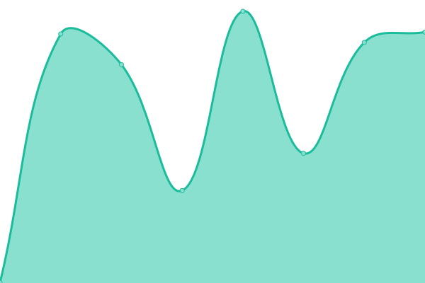
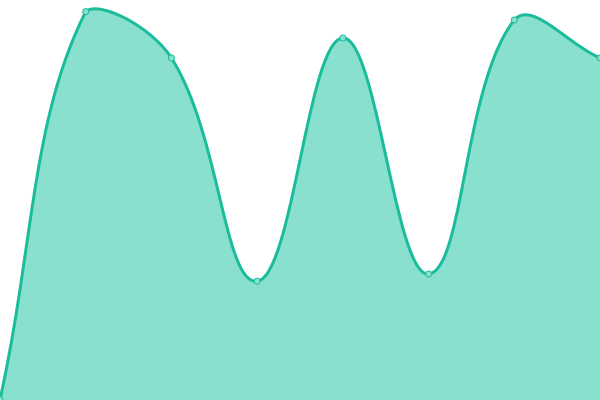
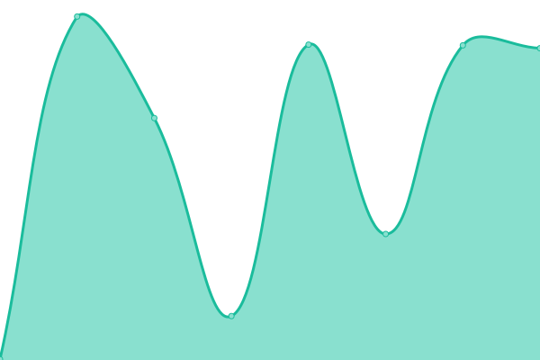

# [📈 Live Status](https://demo.upptime.js.org): <!--live status--> **🟧 Partial outage**

This repository contains the open-source uptime monitor and status page for [Upptime](https://upptime.js.org), powered by [Upptime](https://github.com/upptime/upptime).

With [Upptime](https://upptime.js.org), you can get your own unlimited and free uptime monitor and status page, powered entirely by a GitHub repository. We use [Issues](https://github.com/upptime/upptime/issues) as incident reports, [Actions](https://github.com/justin-sumner/uky-upptime/actions) as uptime monitors, and [Pages](https://demo.upptime.js.org) for the status page.

<!--start: status pages-->
<!-- This summary is generated by Upptime (https://github.com/upptime/upptime) -->
<!-- Do not edit this manually, your changes will be overwritten -->
<!-- prettier-ignore -->
| URL | Status | History | Response Time | Uptime |
| --- | ------ | ------- | ------------- | ------ |
|  [UK Home](https://www.uky.edu) | 🟩 Up | [uk-home.yml](https://github.com/justin-sumner/uky-upptime/commits/HEAD/history/uk-home.yml) | 

 737ms
     
 | 

<a href="https://justin-sumner.github.io/uky-upptime/history/uk-home">100.00%</a>
    

|  [Undergraduate Admissions](https://admission.uky.edu) | 🟩 Up | [undergraduate-admissions.yml](https://github.com/justin-sumner/uky-upptime/commits/HEAD/history/undergraduate-admissions.yml) | 

 612ms
     
 | 

<a href="https://justin-sumner.github.io/uky-upptime/history/undergraduate-admissions">100.00%</a>
    

|  [Transportation](https://transportation.uky.edu) | 🟩 Up | [transportation.yml](https://github.com/justin-sumner/uky-upptime/commits/HEAD/history/transportation.yml) | 

 500ms
     
 | 

<a href="https://justin-sumner.github.io/uky-upptime/history/transportation">100.00%</a>
    

|  [Student Success](https://studentsuccess.uky.edu) | 🟩 Up | [student-success.yml](https://github.com/justin-sumner/uky-upptime/commits/HEAD/history/student-success.yml) | 

 564ms
     
 | 

<a href="https://justin-sumner.github.io/uky-upptime/history/student-success">100.00%</a>
    

|  [College of Engineering](https://engr.uky.edu) | 🟩 Up | [college-of-engineering.yml](https://github.com/justin-sumner/uky-upptime/commits/HEAD/history/college-of-engineering.yml) | 

 527ms
     
 | 

<a href="https://justin-sumner.github.io/uky-upptime/history/college-of-engineering">100.00%</a>
    

|  [College of Arts and Sciences](https://as.uky.edu) | 🟩 Up | [college-of-arts-and-sciences.yml](https://github.com/justin-sumner/uky-upptime/commits/HEAD/history/college-of-arts-and-sciences.yml) | 

 861ms
     
 | 

<a href="https://justin-sumner.github.io/uky-upptime/history/college-of-arts-and-sciences">100.00%</a>
    

|  [College of Business and Economics](https://gatton.uky.edu) | 🟩 Up | [college-of-business-and-economics.yml](https://github.com/justin-sumner/uky-upptime/commits/HEAD/history/college-of-business-and-economics.yml) | 

 447ms
     
 | 

<a href="https://justin-sumner.github.io/uky-upptime/history/college-of-business-and-economics">100.00%</a>
    

|  [College of Agriculture Food and Environment](https://cafe.uky.edu) | 🟥 Down | [college-of-agriculture-food-and-environment.yml](https://github.com/justin-sumner/uky-upptime/commits/HEAD/history/college-of-agriculture-food-and-environment.yml) | 

 0ms
     
 | 

<a href="https://justin-sumner.github.io/uky-upptime/history/college-of-agriculture-food-and-environment">0.00%</a>
    

|  [College of Fine Arts](https://finearts.uky.edu) | 🟩 Up | [college-of-fine-arts.yml](https://github.com/justin-sumner/uky-upptime/commits/HEAD/history/college-of-fine-arts.yml) | 

 446ms
     
 | 

<a href="https://justin-sumner.github.io/uky-upptime/history/college-of-fine-arts">100.00%</a>
    

<!--end: status pages-->

[**Visit our status website →**](https://demo.upptime.js.org)

## 📄 License

- Powered by: [Upptime](https://github.com/upptime/upptime)
- Code: [MIT](./LICENSE) © [Anand Chowdhary](https://anandchowdhary.com), supported by [Pabio](https://pabio.com)
- Data in the `./history` directory: [Open Database License](https://opendatacommons.org/licenses/odbl/1-0/)
